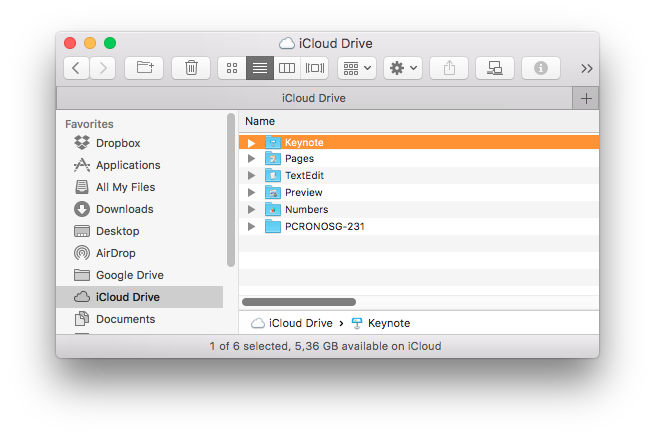

# ICloud Java Client

Demo application showing how to use ICloud4j API in Java.


## Prerequires

1. Git 2.6+
2. Maven 3.3+
3. Java 8+

## How to Play

Clone

```
git clone https://github.com/humbertodias/java-icloud-client-demo.git
```

Inside the folder

```
cd java-icloud-client-demo
```

### Run

```
mvn compile exec:java -Dexec.mainClass="com.mycompany.app.App" -Dexec.args="CLIENTID USERNAME PASSWORD"
```

Don't forget to replace **CLIENTID** **USERNAME** **PASSWORD**

### Info

```
[List Files]
Keynote              - APP_LIBRARY         
Pages                - APP_LIBRARY         
PCRONOSG-231         - FOLDER              
Preview              - APP_LIBRARY   
[INFO] ------------------------------------------------------------------------
[INFO] BUILD SUCCESS
[INFO] ------------------------------------------------------------------------
[INFO] Total time: 11.953 s
[INFO] Finished at: 2017-02-09T15:53:30-02:00
[INFO] Final Memory: 26M/316M
[INFO] ------------------------------------------------------------------------
```

## Output

	
1. List Drop Files
	
	```
	[List Files]
	Keynote              - APP_LIBRARY         
	Pages                - APP_LIBRARY         
	PCRONOSG-231         - FOLDER              
	Preview              - APP_LIBRARY   
	```

2. Output

	


# References

[https://www.icloud.com](https://www.icloud.com)